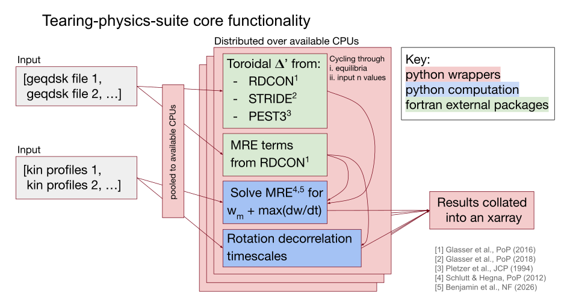

# tearing-physics-suite

A numerically robust nonlinear tokamak tearing analysis tool for large-scale database generation.

Core capabilities:
- general m,n modified Rutherford equation analysis w. cross-field transport stabilisation 
- rotational shear decorrelation timescales 
- multiple-code 𝚫’ values for robustness
- multi-CPU parallelization
- (parallelizable) input sensitivity scans 

These scripts package and compute toroidal 𝚫’ values using pre-existing fortran codes RDCON [1], STRIDE [2] and PEST3 [3].



Warning: tearing-physics-suite makes its own working directories to read & write fortran input & output files. These directories will be spawned inside the install directory, unless the user specifies otherwise.

# Development

Stable versions will have a number designation, while all active development should be applied to the 'develop' branch, following Vincent Driessen's GitFlow <https://nvie.com/posts/a-successful-git-branching-model/>.

# Installation (from source only)

Short version: System agnostic but requires uv, gcc, openmpi, cmake and make
``` 
git clone https://github.com/MIT-PSFC/tearing-physics-suite.git
uv sync
uv run tearing_physics_suite/build_tearing_physics_suite.py  
source tearing_physics_suite_env.sh
uv run tests/run_tests.py  
```

Medium version: Complete install on Omega from login node, requires ssh key permissions for git clone
``` 
salloc -t 02:00:00 --mem=8G  
module purge 
module load gcc/11.x
git clone git@github.com:MIT-PSFC/tearing-physics-suite.git
curl -LsSf https://astral.sh/uv/install.sh | sh 
uv sync 
uv run tearing_physics_suite/build_tearing_physics_suite.py
source tearing_physics_suite_env.sh
uv run tests/run_tests.py 
```

Medium version: Complete install on Engaging from login node, requires ssh key permissions for git clone
```
salloc -t 02:00:00 --mem=8G
module load gcc/12.2.0 openmpi/4.1.4
git clone git@github.com:MIT-PSFC/tearing-physics-suite.git
curl -LsSf https://astral.sh/uv/install.sh | sh 
uv sync 
uv run tearing_physics_suite/build_tearing_physics_suite.py
source tearing_physics_suite_env.sh
uv run tests/run_tests.py
```

Long version: 

1. Set up fortran & c environment:    
    You need to install the software 'gcc', 'openmpi', 'cmake' and 'make' on your system. I used versions gcc/12.2.0 and openmpi/4.1.4, make/4.2.1 and cmake greater than 3.5, but you can try other versions at your own risk.
    Installation may be trivial on a cluster with commands such as 'module load gcc/<version>', 'module load openmpi/<version>'. 
    If you have a linux system with sudo privilege, you can run the terminal command 'apt install gcc openmpi cmake make'. On macOS you can download Homebrew and run in the terminal 'brew install gcc openmpi cmake make'. Specific cluster cases are provided:    
    &emsp;Engaging: (cmake, make installed by default)    
   ```module load gcc/12.2.0 openmpi/4.1.4```    
    &emsp;Omega: (openmpi, make, make installed by default)    
   ```module load gcc/11.x```

3. Download source code in the directory of your choice:
```
git clone git@github.com:MIT-PSFC/tearing-physics-suite.git
```
&emsp;&emsp;or 
```
git clone https://github.com/MIT-PSFC/tearing-physics-suite.git
```

3. Set up python environment:    
    This program utilises uv python software. A simple installation guide is available here - https://github.com/astral-sh/uv. The one-line linux install command is 
``` 
curl -LsSf https://astral.sh/uv/install.sh | sh 
```
&emsp;&emsp;Once you have uv, initialise the uv python environment by entering the tearing-physics-suite directory, and entering terminal command 
``` 
uv sync
```
&emsp;&emsp;You can now run python through the uv environment with command 'uv run python' or scripts using 'uv run python_script.py'.

4. Build external fortran packages:
   
``` 
uv run path/to/tearing-physics-suite/tearing_physics_suite/build_tearing_physics_suite.py
```
&emsp;&emsp;will slowly download the following codes from the following links:
```
        lapack - https://github.com/Reference-LAPACK/lapack/archive/refs/tags/v3.12.0.tar.gz
        hdf5   - https://github.com/HDFGroup/hdf5/releases/download/hdf5_{version}/hdf5-1.14.6.tar.g
        netcdf - https://github.com/Unidata/netcdf-c/archive/refs/tags/v4.9.2.tar.gz
        netcdf-fortran - https://github.com/Unidata/netcdf-fortran/archive/refs/tags/v4.6.1.tar.gz
        scimake - https://github.com/Tech-XCorp/scimake.git
        PEST3   - https://github.com/MIT-PSFC/PEST3 (we have a local copy of the publically available scripts from https://svn.code.sf.net/p/pest3code/code/)
        GPEC    - https://github.com/PrincetonUniversity/GPEC
```
&emsp;&emsp;and build them using a combination of make and cmake software. I recommend    
&emsp;&emsp;debugging this script with an AI agent if something goes wrong. V0 works    
&emsp;&emsp;on the clusters OMEGA and Engaging (more to come...)

5. Load enviornmental variables: 
```
source path/to/tearing-physics-suite/tearing_physics_suite_env.sh
```
&emsp;&emsp;will load various paths and environmental variables necessary to    
&emsp;&emsp;run tearing-physics-suite, as well as PEST3 and GPEC packages from the terminal.

6. Run tests:
```
uv run path/to/tearing-physics-suite/tests/unit_test_suite.py
```
&emsp;&emsp;will test the package's core functionalities. These tests include the examples listed below.    

For general use repeat steps 1, 3 & 5.

# Examples

For example calculations of linear and nonlinear plasma tearing stability (without rotation terms):  
```
uv run tests/tearing_physics_suite_tests.py
```

For an example calculation of the nonlinear tearing stability, with dimensionless rotation-decorrelation timescale ratios included:
```
uv run tests/rotation_tests.py
```

In a multi-CPU computational environment (default slurm) run parallel calculation examples using:
```
uv run tests/parallelisation_tests.py
```

To run example numerical sensitivity scans, and input variable scans:
```
uv run tests/input_test_runner_test.py
```
If you are in a multi-CPU computational environment, you can run multiple input sensitivity scans in parallel by setting run_parallel_tests to True in that file.

Remaining tests ```tests/delta_prime_extraction_tests.py```, ```tests/fortran_wrapper_test.py```, ```tests/mre_analysis_tests.py``` function as unit tests.
