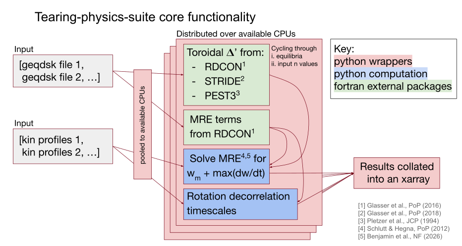

# tearing-physics-suite
[](https://doi.org/10.5281/zenodo.19209232)

A numerically robust nonlinear tokamak tearing analysis tool for large-scale database generation.

Core capabilities:
- general m,n modified Rutherford equation analysis w. cross-field transport stabilisation 
- rotational shear decorrelation timescales 
- multiple-code 𝚫’ values for robustness
- multi-CPU parallelization
- (parallelizable) input sensitivity scans 

These scripts package and compute toroidal 𝚫’ values using pre-existing fortran codes RDCON [1], STRIDE [2] and PEST3 [3].
Optionally (`run_jgpec=True`, `jgpec_solvers=('galerkin', 'riccati')`), 𝚫’ also comes from jGPEC, the Julia GPEC
(`$JGPEC_HOME`, default `/fusion/projects/tmdb/src/GPEC`), as codes `jGPEC_galerkin` / `jGPEC_riccati`.



Warning: tearing-physics-suite makes its own working directories to read & write fortran input & output files. These directories will be spawned inside working_dir/ at the repository root, unless the user specifies otherwise.

# Package layout

- `tearing_physics_suite/physics/`: analysis and physics (Delta' coupling, MRE terms, rotation, global quantities, dataset combination). Never runs or imports the Fortran wrappers.
- `tearing_physics_suite/wrappers/`: input writing, running and reading of RDCON, STRIDE, PEST3 and jGPEC; `wrappers/build/` builds them and their libraries.
- `tearing_physics_suite/drivers/`: the run pipeline (`pipeline.py`), parallel runs and zarr compilation, profile readers, input scans and the input test suite.
- `tearing_physics_suite/utils.py`: small shared helpers.

# Development

Stable versions will have a number designation, while all active development should be applied to the 'develop' branch, following Vincent Driessen's GitFlow <https://nvie.com/posts/a-successful-git-branching-model/>.

# Installation (from source only)

#### Short version:
System agnostic but requires uv, gcc, openmpi, cmake and make.
``` 
git clone --recurse-submodules https://github.com/MIT-PSFC/tearing-physics-suite.git
uv sync
uv run tearing_physics_suite/wrappers/build/build_tearing_physics_suite.py  
source tearing_physics_suite_env.sh
uv run pytest  
```

#### Medium version:
Complete install on Omega from login node, requires ssh key permissions for git clone.
``` 
salloc -t 02:00:00 --mem=8G  
module purge
module load default-paths 
module load gcc/11.x
git clone --recurse-submodules git@github.com:MIT-PSFC/tearing-physics-suite.git
curl -LsSf https://astral.sh/uv/install.sh | sh 
uv sync 
uv run tearing_physics_suite/wrappers/build/build_tearing_physics_suite.py
source tearing_physics_suite_env.sh
uv run pytest 
```
Complete install on Engaging from login node, requires ssh key permissions for git clone.
```
salloc -t 02:00:00 --mem=8G
module load gcc/12.2.0 openmpi/4.1.4
git clone --recurse-submodules git@github.com:MIT-PSFC/tearing-physics-suite.git
curl -LsSf https://astral.sh/uv/install.sh | sh 
uv sync 
uv run tearing_physics_suite/wrappers/build/build_tearing_physics_suite.py
source tearing_physics_suite_env.sh
uv run pytest
```

#### Long version: 

1. Set up fortran & c environment:    
    You need to install the software 'gcc', 'openmpi', 'cmake' and 'make' on your system. I used versions gcc/12.2.0 and openmpi/4.1.4, make/4.2.1 and cmake greater than 3.5, but you can try other versions at your own risk.
    Installation may be trivial on a cluster with commands such as 'module load gcc/<version>', 'module load openmpi/<version>'. 
    If you have a linux system with sudo privilege, you can run the terminal command 'apt install gcc openmpi cmake make'. On macOS you can download Homebrew and run in the terminal 'brew install gcc openmpi cmake make'. Specific cluster cases are provided:    
    &emsp;Engaging: (cmake, make installed by default)    
   ```module load gcc/12.2.0 openmpi/4.1.4```    
    &emsp;Omega: (openmpi, make, make installed by default)    
   ```module load gcc/11.x```

3. Download source code in the directory of your choice:
```
git clone --recurse-submodules git@github.com:MIT-PSFC/tearing-physics-suite.git
```
&emsp;&emsp;or 
```
git clone --recurse-submodules https://github.com/MIT-PSFC/tearing-physics-suite.git
```

3. Set up python environment:    
    This program utilises uv python software. A simple installation guide is available here - https://github.com/astral-sh/uv. The one-line linux install command is 
``` 
curl -LsSf https://astral.sh/uv/install.sh | sh 
```
&emsp;&emsp;Once you have uv, initialise the uv python environment by entering the tearing-physics-suite directory, and entering terminal command 
``` 
uv sync
```
&emsp;&emsp;You can now run python through the uv environment with command 'uv run python' or scripts using 'uv run python_script.py'.

4. Build external fortran packages:
   
``` 
uv run path/to/tearing-physics-suite/tearing_physics_suite/wrappers/build/build_tearing_physics_suite.py
```
&emsp;&emsp;will slowly download the following codes from the following links:     
&emsp;&emsp;&emsp;lapack - https://github.com/Reference-LAPACK/lapack/archive/refs/tags/v3.12.0.tar.gz    
&emsp;&emsp;&emsp;hdf5   - https://github.com/HDFGroup/hdf5/releases/download/hdf5_1.14.6/hdf5-1.14.6.tar.gz    
&emsp;&emsp;&emsp;netcdf - https://github.com/Unidata/netcdf-c/archive/refs/tags/v4.9.2.tar.gz    
&emsp;&emsp;&emsp;netcdf-fortran - https://github.com/Unidata/netcdf-fortran/archive/refs/tags/v4.6.1.tar.gz    
&emsp;&emsp;&emsp;scimake - https://github.com/Tech-XCorp/scimake.git    
&emsp;&emsp;&emsp;PEST3   - https://github.com/MIT-PSFC/PEST3 (a local copy of https://svn.code.sf.net/p/pest3code/code/)    
&emsp;&emsp;&emsp;GPEC    - https://github.com/PrincetonUniversity/GPEC    
&emsp;&emsp;and build them using a combination of make and cmake software. I recommend    
&emsp;&emsp;debugging this script with an AI agent if something goes wrong. V0 works    
&emsp;&emsp;on the clusters OMEGA and Engaging (more to come...)    
&emsp;&emsp;On slow shared filesystems (e.g. NERSC CFS) add `--work-dir <fast dir>` (or set    
&emsp;&emsp;`TPS_BUILD_DIR`) to compile PEST3 and GPEC there; the executables are copied back into `submodules/`.
&emsp;&emsp;PEST3 and GPEC are git submodules (`submodules/PEST3`, `submodules/GPEC`) pinned to a commit; the build    
&emsp;&emsp;runs `git submodule update --init` if they are missing, and warns if an existing checkout is not at the pin.    
&emsp;&emsp;`--rebuild-gpec`/`--rebuild-pest3` clean the build products and keep the source.    
&emsp;&emsp;To bump a pin:
```
cd submodules/GPEC && git checkout <sha> && cd ../.. && git add submodules/GPEC && git commit
```

5. Load environmental variables: 
```
source path/to/tearing-physics-suite/tearing_physics_suite_env.sh
```
&emsp;&emsp;will load various paths and environmental variables necessary to    
&emsp;&emsp;run tearing-physics-suite, as well as PEST3 and GPEC packages from the terminal.

6. Run tests:
```
cd path/to/tearing-physics-suite
uv run pytest                                   # fast unit tests (no Fortran)
uv run pytest -m "fortran and not slow"         # RDCON/STRIDE/PEST3 runs and golden comparisons
uv run pytest -m "parallel or slow"             # multi_run (>= 2 CPUs) and input scans
uv run pytest -m julia                          # jGPEC runs (first run in a process compiles, a few minutes)
```
&emsp;&emsp;Markers: `fortran`, `julia`, `parallel`, `slow` (see `pyproject.toml`). Run the marked tests on a compute node.    
&emsp;&emsp;The golden comparisons need a reference made by `tests/golden/cases.py` (set `TPS_GOLDEN_DIR`, or symlink `tests/data/golden`).

#### For general use repeat steps 1, 3 & 5.

# Examples

`tests/golden/cases.py` holds example calls, all on the test equilibrium in `tests/data/`:
- `case_nonlinear_wall_rotation`: nonlinear tearing stability, with dimensionless rotation-decorrelation timescale ratios included;
- `case_nonlinear_nowall`: nonlinear tearing stability without a wall;
- `case_linear_wall`: linear (Delta' only) calculation;
- `case_multi_run_zarr`: parallel runs (`multi_run_`) compiled into a zarr store.

Input sensitivity scans are listed in `tearing_physics_suite/drivers/input_test_suite.py` and run with `run_multiple_scans` (or `run_multiple_scans_parallel`) from `drivers/input_test_runner.py`; see `tests/integration/test_input_scans.py`.

# Licensing

This page's MIT license only applies to the scripts inside this git repository. In using or distributing this repository, you must also adhere to the licenses of the downloaded codes within, which can be found at the following URLs:    
&emsp;&emsp;&emsp;lapack - https://github.com/Reference-LAPACK/lapack    
&emsp;&emsp;&emsp;hdf5   - https://github.com/HDFGroup/hdf5    
&emsp;&emsp;&emsp;netcdf - https://github.com/Unidata/netcdf-c    
&emsp;&emsp;&emsp;netcdf-fortran - https://github.com/Unidata/netcdf-fortran    
&emsp;&emsp;&emsp;scimake - https://github.com/Tech-XCorp/scimake.git    
&emsp;&emsp;&emsp;PEST3   - https://github.com/MIT-PSFC/PEST3, https://svn.code.sf.net/p/pest3code/code/    
&emsp;&emsp;&emsp;GPEC    - https://github.com/PrincetonUniversity/GPEC    


# Acknowledgements

The development of these scripts was supported by Commonwealth Fusion Systems, and DOE FES under Award DE-SC0024368, "Open and FAIR Fusion for Machine Learning Applications", and DE-SC0014264.

# Citation

Tearing-physics-suite can be cited as follows:
- Benjamin, S., Rea, C., & MIT PSFC Disruption Studies Group. Tearing-physics-suite: A numerically robust nonlinear tokamak tearing analysis tool for large-scale database generation [Computer software]. doi:10.5281/zenodo.19209232 https://github.com/MIT-PSFC/tearing-physics-suite    
- S Benjamin, _et al._ (2026), _"Macroscopic trends of neoclassical tearing stability in high-field H-mode tokamak pilot plants"_, Nuclear Fusion 66 036049 [(https://doi.org/10.1088/1741-4326/ae44ad)](https://doi.org/10.1088/1741-4326/ae44ad).    

We also recommend citing the underlying 𝚫’ codes:    
[1] Glasser, _et al._ (2016), _"Computation of resistive instabilities by matched asymptotic expansions"_, Physics of Plasmas 23 112506 [(https://doi.org/10.1063/1.4967862)](https://doi.org/10.1063/1.4967862)    
[2] Glasser, _et al._ (2018), _"A robust solution for the resistive MHD toroidal 𝚫’ matrix in near real-time"_, Physics of Plasmas 25 082502 [(https://doi.org/10.1063/1.5029477)](https://doi.org/10.1063/1.5029477)    
[3] Pletzer, _et al._ (1994), _"Linear Stability of Resistive MHD Modes: Axisymmetric Toroidal Computation of the Outer Region Matching Data"_, Journal of Computational Physics 115, 530-549 [(https://doi.org/10.1006/jcph.1994.1215)](https://doi.org/10.1006/jcph.1994.1215)
