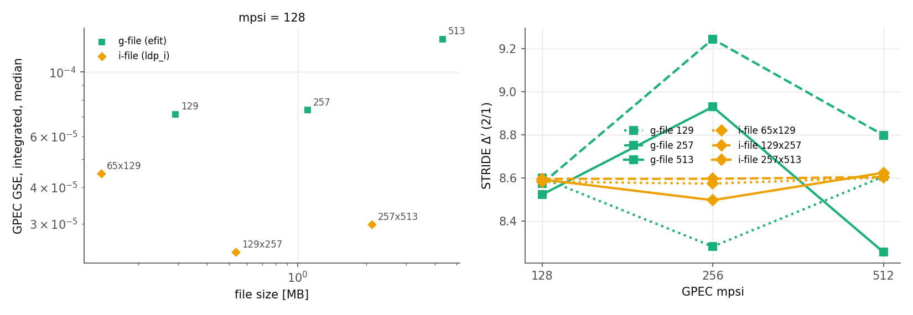

# GPEC PR report: `OFT_interface` → `develop`

This PR builds on `spline_improvements`.

- **Branch:** `OFT_interface`, 1 commit on top of `spline_improvements` `a95a365b`.

## Purpose
Read OpenFUSIONToolkit/TokaMaker i-files (`save_ifile`, OFT branch `ifile_fixes_for_GPEC_interface`) with `eq_type = "ldp_i"`. The pieces that make this path accurate are spread over three PRs:
- **OFT `ifile_fixes_for_GPEC_interface`:** points lie exactly on their flux surfaces, and FF′ and p′ records are written. See [ifile_fixes_for_GPEC_interface.md](ifile_fixes_for_GPEC_interface.md).
- **`spline_improvements`:** reads the optional FF′ and p′ records with `profile_source = integrate`.
- **This PR:** the remaining reader fix.

## Changes
1. **`read_eq_ldp_i` takes |F|** (`19a8099b`), as `read_eq_efit` does.
   - `inverse_run` computes q in proportion to F. An i-file with F < 0 (TokaMaker with B_t < 0) therefore stopped with "Invalid extrapolation near axis".
   - With the fix, flipping the sign of F in a file gives the same Δ′ to every digit: 8.50824 for both.
2. **The i-file format is documented** in the reader header.

## Results: i-file vs g-file
One TokaMaker reference equilibrium (DIII-D-like, q0 = 1.25, q95 = 4.49), written by `save_ifile` with FF′ and p′ records and by `save_eqdsk`, run through STRIDE with `profile_source = integrate`. The last surface is at the same true ψ_N = 0.985 in every run. Integrated GSE is the θ-integrated residual over the θ-integrated source, median over 0.05 < ψ_N < 0.95.

| file | size | GSE local / integrated (mpsi = 128) | Δ′(2/1), mpsi = 128 | 256 | 512 |
|---|---|---|---|---|---|
| g-file 129×129 (`efit`) | 0.29 MB | 1.7e-4 / 7.1e-5 | 8.60 | 8.28 | 8.61 |
| g-file 257×257 | 1.1 MB | 1.8e-4 / 7.4e-5 | 8.57 | 9.24 | 8.80 |
| g-file 513×513 | 4.3 MB | 1.8e-4 / 1.3e-4 | 8.52 | 8.93 | 8.26 |
| i-file 65×129 (`ldp_i`) | 0.14 MB | 2.4e-4 / 4.5e-5 | 8.58 | 8.57 | 8.60 |
| i-file 129×257 | 0.54 MB | 1.5e-4 / 2.4e-5 | 8.60 | 8.60 | 8.60 |
| i-file 257×513 | 2.1 MB | 1.7e-4 / 3.0e-5 | 8.59 | 8.50 | 8.62 |

- The i-files give Δ′(2/1) = 8.50–8.62 at every mpsi; the g-files scatter over 8.26–9.24 at mpsi ≥ 256 (single-precision ψ(R,Z)).
- The i-files' integrated GSE is 1.6–5× lower than the g-files'.
- A 129×257 i-file (0.54 MB) beats the 513×513 g-file (4.3 MB) on both counts.

## Status
- [x] Built; the negative-F test above passes
- [x] CI Solovev examples. Compared with `Zeff_profile_support` `99378252`, which also has the vacuum fix, on the full chain (OFT_interface = spline_improvements + this commit):
  - The DCON, STRIDE, RDCON and GPEC outputs of the ideal and resistive Solovev examples are **bit-for-bit identical**.
  - The kinetic example differs by up to 8e-5, and PENTRC by up to 1e-6 in n and T, because PENTRC's kinetic table now uses pchip. The exceptions are the last 2 of 17 PENTRC output points next to the edge (ψ_N > 0.99), where T → 0: there `logLambda`/`nu` were already unphysical (negative) with the cubic spline and change value.
  - The example pass/fail pattern is unchanged; the gpec/pentrc/rmatch "failures" in the DIIID examples happen the same way on the base build.

## How to reproduce
The scripts and their inputs ship with this PR as `OFT_interface_scripts.zip`; its `README.md` has the commands.
