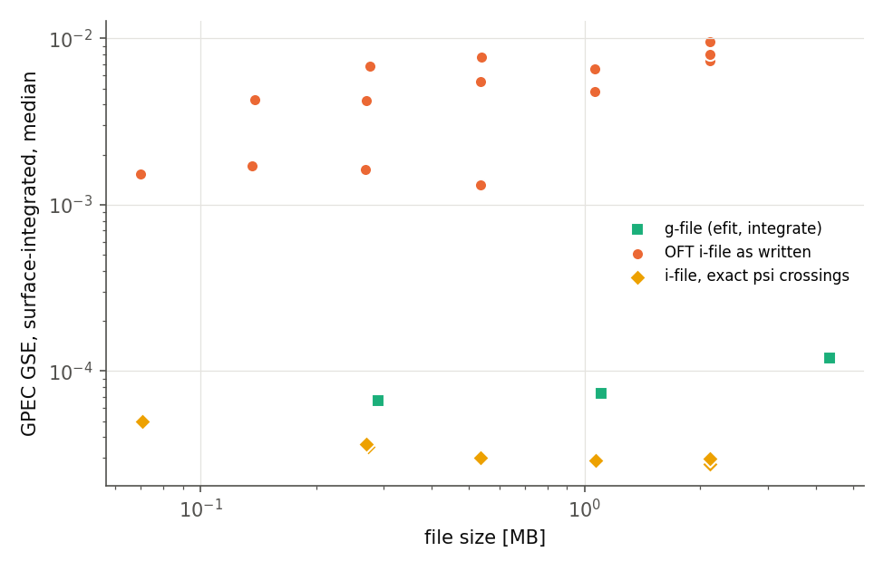

# GPEC PR report: `spline_improvements` → `develop`

This PR builds on `Zeff_profile_support`.

- **Branch:** `spline_improvements`, local only, 6 commits on top of `0b4a7720`.
- **Worktree:** `$PSCRATCH/tmdb/build/gpec_wt/spline_improvements`. The commits live in the repository at `submodules/GPEC`.
- **Scripts and data:** scripts are in `spline_improvements/scripts/`. Results are in `$PSCRATCH/tmdb/gpec_spline_tests/`, which is purged after 8 weeks; rerun the scripts to regenerate them.

## Problem
`read_eq_efit` read the g-file's FFPRIM and PPRIME columns and then threw them away.

- F and p were cubic-splined and then differentiated.
- TokaMaker writes single-precision values, and F changes by only about 2% across the plasma.
- Differentiating twice turns that rounding into noise of tens of percent in F″, which is the current gradient that Δ′ depends on (`FFp_error.png`).
- Julia GPEC PR #506 found and fixed the same defect.

## Changes
Each change is its own commit.

1. **`spline_fit_hermite(spl, endmode, keep)`** (`equil/spline.f`). This is the ordinary fit, except that the caller's knot derivatives `fs1` are kept for the columns marked in `keep`.
   - GPEC already stores every spline as a cubic Hermite, so evaluation, integration and `euler.bin` are unchanged.
2. **New `equil.in` variable `profile_source`** (`read_eq.f`, `global.f`, `equil.f`). It applies to `efit` and to `ldp_i` when the file has FF′ and p′ records. Options:
   - `values`: the old behaviour (tabulated values, spline-fitted derivatives);
   - `hermite`: tabulated values, with the file's FF′/F and p′ as slopes;
   - `integrate`: F²/2 and p integrated inward from their boundary values, with the file's derivatives as slopes. This is the method of PR #506.

   Supporting changes:
   - **Fallback:** if the derivatives are non-finite, give F² ≤ 0, or disagree in sign with the values, GPEC falls back to `values` and prints a warning.
   - **Consistency report:** GPEC reports the largest gap between the tabulated values and the integrated derivatives.
   - **Reader bug fixed:** `read_eq_efit` no longer writes out of bounds when the g-file has no q column.
   - **`read_eq_ldp_i`** reads optional trailing FF′ and p′ records. These are FF′ = F dF/dψ and p′ in Pa, both against ψ in Wb/rad.
3. **`direct_run` and `inverse_run` keep the slopes** for `sq_in` and `sq`. The `newq0` rescaling updates F′ as F′/ffac. With `profile_source = "values"`, the output is bit-for-bit identical to before; this was checked on the TkMkr example's `delta_prime.out`, `gsec.bin`, `gsei.bin` and the netcdf data.
4. **The `sq_out` diagnostic (`out_eq_1d`) keeps the supplied slopes.**
5. **The default is `profile_source = "integrate"`.** The evidence is below.
6. **`regression/spline_tests/`** contains a unit test (`make run`) with three checks:
   - Hermite with exact slopes converges at 4.00 order;
   - the `"extrap"` end slopes converge at 3.2 order;
   - columns that are not kept come out bit-for-bit as `spline_fit` gives them.

   The test fails to link against the old library.

**End conditions:** `"extrap"` needs no change. It is a clamped spline whose end slopes come from a 4-point Lagrange cubic; the end slope is O(h³), as the unit test shows. For F and p the end slopes now come from the file, so `"extrap"` no longer sets them.

**pchip and Akima are not included.** As the user noted, "pchip and akima can't be constrained by derivatives". Once derivatives are supplied they reduce to the same Hermite form. They could come back later as an option for tabulated data that has no derivatives, such as Zeff.

## Evidence
The reference is a TokaMaker equilibrium (`scripts/make_truth_equilibrium.py`): DIII-D-like, q0 = 1.25, q95 = 4.49. Its FF′ and p′ are dense and smooth, so F, F′, F″ and p′ are known exactly at every ψ. Its g-files and i-files were written with the unmodified OFT install `f2098a9`.

**1. F″ against the exact value** (`scripts/gpec_profiles.py`, which reproduces GPEC's sq construction), for the 257-point g-file:


Root-mean-square error in F″ for 0.1 < ψ_N < 0.85:

| file | mpsi | values | hermite | **integrate** |
|---|---|---|---|---|
| g257 | 128 | 1.8% | 5.1% | **0.8%** |
| g257 | 512 | 12% | 14% | **0.19%** |
| g513 | 512 | 29% | 47% | **0.09%** |

`values` and `hermite` get worse as the grid is refined, because the noise in the values is amplified by 1/h². `integrate` converges.

`hermite`, which keeps the noisy values alongside exact slopes, is the worst: inside each interval F″ is set by (F₁−F₀)/h².

**2. STRIDE Δ′(2/1)** (`scripts/run_profile_source_comparison.py`):

| file | profile_source | mpsi = 128 | 256 | 512 |
|---|---|---|---|---|
| g129 | values / integrate | 8.58 / 8.59 | 8.86 / 8.28 | 9.24 / 7.99 |
| g257 | values / integrate | 8.45 / 8.59 | 10.25 / 9.19 | 8.76 / 8.48 |
| g513 | values / integrate | 8.46 / 8.45 | 9.32 / 8.48 | 11.97 / 14.06 |
| g257 | hermite | 9.02 | 10.45 | 9.31 |
| i-files, exact ψ crossings (4 files) | integrate | 8.37–8.50 | 8.38–8.47 | 8.52–8.60 |

- At the default mpsi = 128, `integrate` is consistent across g-file resolutions to ±1%.
- At mpsi ≥ 256, the g-file results scatter with every profile_source. The 2D ψ(R,Z) table is also single precision, so the geometry is noisy as well as the profiles.
- An inverse file with accurate R and Z converges at every mpsi (next section). The profile fix is needed, but it does not remove all of the g-file error.


## Inverse file vs g-file: GSE and file size (`scripts/run_ifile_comparison.py`)
All files come from the same TokaMaker equilibrium, with the last surface at the same true ψ_N = 0.985 and mpsi = 128. Integrated GSE is the θ-integrated residual divided by the θ-integrated source, taking the median over 0.05 < ψ_N < 0.95.

| file | size | Δ′(2/1) | GSE local, median | GSE integrated, median |
|---|---|---|---|---|
| g129 / g257 / g513 (efit, integrate) | 0.29 / 1.1 / 4.3 MB | 8.59 / 8.59 / 8.45 | 1.6–2.2e-4 | 0.7–1.2e-4 |
| OFT i-file 65×65 / 129×257 / 257×513 | 0.07 / 0.53 / 2.1 MB | 7.44 / 0.35 / −2.50 | 1.2e-3 / 2.3e-3 / 1.3e-3 | 1.5e-3 / 7.6e-3 / 7.4e-3 |
| same, with FF′ and p′ records | same | unchanged | unchanged | unchanged |
| i-file with exact ψ crossings, 129×257 / 257×513 | 0.54 / 2.1 MB | 8.49 / 8.50 | 1.7e-4 / 1.8e-4 | 3.0e-5 / 2.9e-5 |



**Why the `ldp_i` GSE has been high: the problem is in the file, not in GPEC's reader or its GSE check.**
- The R,Z points that OFT `gs_save_ifile` writes are about 2e-7 m off the true ψ = ψ_k crossings (median), with occasional points up to 1e-3 m off. This was measured by Newton iteration on TokaMaker's own FEM ψ along each ray (`scripts/diag_ifile_noise.py`).
- The file's own Grad–Shafranov residual, computed independently of GPEC (`scripts/ifile_tools.py gs_residual`), grows as the grid is refined:

  | npsi | 65 | 129 | 257 |
  |---|---|---|---|
  | file's own residual | 2e-3 | 5e-3 | 1.8e-2 |

  Errors in individual surface positions are amplified by the second derivatives in ψ.
- When the same points are placed at the exact crossings, the residual stays at 3–4e-4 (the FEM limit) at every resolution.
- GPEC then gives GSE equal to or better than the g-file path, and the integrated GSE is 2–4× lower.
- Its Δ′ agrees with the g-file result at mpsi = 128 and stays put as mpsi is refined.
- **A 129×257 i-file (0.54 MB) beats a 257×257 g-file (1.1 MB).**

The fix belongs in OFT `gs_save_ifile`: place each point at the exact crossing, or tighten the tracing tolerance. It is the first item for the `OFT_interface` / `GPECf_interface` branches.

## Effects on results and on TPS
- **Results change for every g-file run.** With the new default, `efit` results change by design. Examples:
  - DIIID ideal example: μ0p changes by up to 3.7e-4 relative, D_I by up to 2.6e-3.
  - g147131: Δ′(2/1) goes from 8.00 to 8.14 at mpsi = 128.
  - TPS reference values (±0.1 tolerances) will need updating once TPS builds against this branch.
- **Unchanged:** the CI Solovev regressions (ideal, kinetic, resistive) are bit-for-bit identical. The other example pass/fail outcomes match the base branch.
- **Not carried by the dump path:** `eq_type = "dump"` (`equil_out_dump` / `read_eq_dump`) writes only `sq%fs`, so the supplied slopes are lost on a dump round trip. Making them survive would need a change to the dump format.

## How to reproduce
```bash
source scripts/env.sh          # tmdb_env.sh + tearing_physics_suite_env.sh, sets TPS, GPEC, WT
cd $WT/spline_improvements/install && make -j8 && make -C ../regression/spline_tests run
PYTHONPATH=$OFT_INSTALL/python $PY scripts/make_truth_equilibrium.py
$TPS_PY scripts/run_profile_source_comparison.py $WT/spline_improvements/bin OUT [mpsi=256]
$TPS_PY scripts/run_ifile_comparison.py $WT/spline_improvements/bin OUT
PYTHONPATH=$OFT_INSTALL/python $PY scripts/diag_ifile_noise.py truth/i*.ifile   # writes *_exact.ifile
$TPS_PY scripts/run_exact_ifiles.py $WT/spline_improvements/bin OUT *_exact.ifile
PYTHONPATH=$OFT_INSTALL/python $TPS_PY scripts/make_figures.py RESULTS FIGDIR
```
