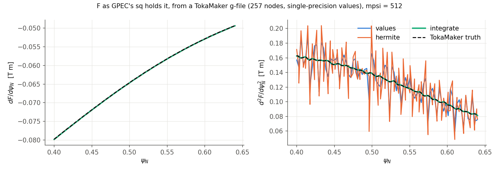
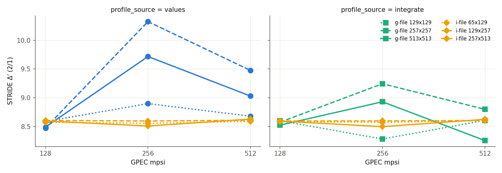

# GPEC PR report: `spline_improvements` → `develop`

This PR builds on `Zeff_profile_support` (PR #296). It fixes an issue identified and fixed by d-burg in Julia GPEC PR [#506](https://github.com/OpenFUSIONToolkit/GPEC/pull/506)

- **Branch:** `spline_improvements`, 6 commits on top of `0b4a7720`, then the merge of `bugfix/dcon-vacuum-theta-frame` (via `Zeff_profile_support`) and 6 more commits (below), the last two from a code review.

## Problem
`read_eq_efit` read the g-file's FFPRIM and PPRIME columns and then threw them away.

- F and p were cubic-splined and then differentiated.
- TokaMaker writes single-precision values, and F changes by only about 2% across the plasma.
- Differentiating twice turns that rounding into noise of tens of percent in F″, which is the current gradient that Δ′ depends on (`FFp_error.png`).

## Changes
Each change is its own commit.

1. **`spline_fit_hermite(spl, endmode, keep)`** (`equil/spline.f`). This is the ordinary fit, except that the caller's knot derivatives `fs1` are kept for the columns marked in `keep`.
   - GPEC already stores every spline as a cubic Hermite, so evaluation, integration and `euler.bin` are unchanged.
2. **New `equil.in` variable `profile_source`** (`read_eq.f`, `global.f`, `equil.f`). It applies to `efit` and to `ldp_i` when the file has FF′ and p′ records. Options:
   - `values`: the old behaviour (tabulated values, spline-fitted derivatives);
   - `integrate`: F²/2 and p integrated inward from their boundary values, with the file's derivatives as slopes kept by `spline_fit_hermite`. This is the method of PR [#506](https://github.com/OpenFUSIONToolkit/GPEC/pull/506).
   - A third option, `hermite` (tabulated values with the file's slopes), was tested and dropped (item 13).

   Supporting changes:
   - **Fallback:** if the derivatives are non-finite, give F² ≤ 0, or disagree in sign with the values, GPEC falls back to `values` and prints a warning.
   - **Consistency report:** GPEC reports the largest gap between the tabulated values and the integrated derivatives.
   - **Reader bug fixed:** `read_eq_efit` no longer writes out of bounds when the g-file has no q column.
   - **`read_eq_ldp_i`** reads optional trailing FF′ and p′ records. These are FF′ = F dF/dψ and p′ in Pa, both against ψ in Wb/rad.
3. **`direct_run` and `inverse_run` keep the slopes** for `sq_in` and `sq`. The `newq0` rescaling updates F′ as F′/ffac. With `profile_source = "values"`, the output is bit-for-bit identical to before; this was checked on the TkMkr example's `delta_prime.out`, `gsec.bin`, `gsei.bin` and the netcdf data.
4. **The `sq_out` diagnostic (`out_eq_1d`) keeps the supplied slopes.**
5. **The default is `profile_source = "integrate"`.** The evidence is below.
6. **`regression/spline_tests/`** contains a unit test (`make run`) with three checks:
   - Hermite with exact slopes converges at 4.00 order;
   - the `"extrap"` end slopes converge at 3.2 order;
   - columns that are not kept come out bit-for-bit as `spline_fit` gives them.

   The test fails to link against the old library.

**End conditions:** `"extrap"` needs no change. It is a clamped spline whose end slopes come from a 4-point Lagrange cubic; the end slope is O(h³), as the unit test shows. For F and p the end slopes now come from the file, so `"extrap"` no longer sets them.

**pchip and Akima are not used for F and p:** they cannot be constrained by derivatives, and once derivatives are supplied they reduce to the same Hermite form. pchip is used for tabulated data without derivatives (item 11).

## Evidence
The reference is a TokaMaker equilibrium (`make_truth_equilibrium.py`): DIII-D-like, q0 = 1.25, q95 = 4.49. Its FF′ and p′ are dense and smooth, so F, F′, F″ and p′ are known exactly at every ψ. It is written as g-files (129², 257², 513²; `efit`, direct) and as i-files with FF′ and p′ records (65×129, 129×257, 257×513; `ldp_i`, inverse). The last surface is at the same true ψ_N = 0.985 in every run.

**1. F″ against the exact value** (`gpec_profiles.py`, which reproduces GPEC's sq construction), for the 257-point g-file:



Root-mean-square error in F″ for 0.1 < ψ_N < 0.85:

| file | mpsi | values | hermite | **integrate** |
|---|---|---|---|---|
| g257 | 128 | 1.8% | 5.1% | **0.8%** |
| g257 | 512 | 12% | 14% | **0.19%** |
| g513 | 512 | 29% | 47% | **0.09%** |

`values` and `hermite` get worse as the grid is refined, because the noise in the values is amplified by 1/h². `integrate` converges.

`hermite`, which keeps the noisy values alongside exact slopes, is the worst: the values' rounding noise has nowhere to go but F″ inside each interval, about (value error)/h². It was dropped (item 13).

**2. STRIDE Δ′(2/1), `values` / `integrate`** (`run_profile_source_comparison.py`):

| file | mpsi = 128 | 256 | 512 |
|---|---|---|---|
| g129 | 8.59 / 8.60 | 8.90 / 8.28 | 8.68 / 8.61 |
| g257 | 8.47 / 8.57 | 10.33 / 9.24 | 9.48 / 8.80 |
| g513 | 8.49 / 8.52 | 9.72 / 8.93 | 9.03 / 8.26 |
| i65×129 | 8.57 / 8.58 | 8.56 / 8.57 | 8.59 / 8.60 |
| i129×257 | 8.60 / 8.60 | 8.60 / 8.60 | 8.61 / 8.60 |
| i257×513 | 8.60 / 8.59 | 8.51 / 8.50 | 8.63 / 8.62 |
| TkMkr example (g-file) | 7.42 / 7.47 | 6.14 / 6.18 | 11.71 / 9.90 |
| g147131 (EFIT) | 8.04 / 8.18 | 8.40 / 8.46 | 8.18 / 8.63 |



- **Direct equilibria (g-files):** `integrate` cuts the spread across the three g-files from 1.43 to 0.96 at mpsi = 256 and from 0.80 to 0.54 at mpsi = 512, and moves them toward the converged value. The remaining scatter comes from the single-precision ψ(R,Z) table, which this PR does not touch.
- **Inverse equilibria (i-files):** F and p are stored in double precision and agree with FF′ and p′, so the two settings agree to 0.2% at every resolution, and every i-file gives 8.50–8.63. `integrate` is safe for inverse equilibria and uses the same profile derivatives as the direct path.
- GPEC's integrated GSE changes by up to 30% between the two settings, in either direction; it is set mostly by the geometry, not the profiles.

## Effects on results
- **Results change for every g-file run.** With the new default, `efit` results change by design. Examples:
  - DIIID ideal example: μ0p changes by up to 3.7e-4 relative, D_I by up to 2.6e-3.
  - g147131: Δ′(2/1) goes from 8.04 to 8.18 at mpsi = 128.
  - Downstream reference values tuned to the old profiles (e.g. Δ′ tolerances of ±0.1) will move.
- **Unchanged:** the CI Solovev regressions (ideal, kinetic, resistive) are bit-for-bit identical. The other example pass/fail outcomes match the base branch.
- **Dump path:** fixed (items 8 and 9).

## Further changes
7. **Merge of `bugfix/dcon-vacuum-theta-frame`** (`0bb9a111`, via `Zeff_profile_support` `99378252`), It puts the DCON/RDCON/STRIDE vacuum matrix in the plasma's Fourier frame. It merged cleanly.
8. **Bug fix in `direct_run`** (`822e8b59`). A second `sq%title` assignment with 4 entries (gfortran reallocates on assignment) made the dump record 6 bytes short, so `eq_type="dump"` always failed with "I/O past end of record". That made the dump path unusable before this work.
9. **`eq_type="dump"` keeps the slopes and `eqfun`** (`8717d832`). `equil_out_dump` appends `sq_in_slopes(1:2), sq%fs1(:,1:2)` and then `eqfun%fs` after the old records. `read_eq_dump` reads them when present (older dumps read as before) and no longer fails when STRIDE re-reads the equilibrium.
   - DCON: efit → dump → `eq_type=dump` reproduces f, μ0p, q, D_I and D_R **exactly**, for both `integrate` and `values`.
   - STRIDE: its psilim reform regrids the equilibrium, so Δ′(2/1) differs by about 1% (7.47 against 7.39) for both profile sources.
10. **`spline_fit_pchip`** (`de7440b5`). Monotone cubic Hermite (Fritsch–Carlson) with scipy's end slopes; the unit test matches scipy `PchipInterpolator` to 1e-7.
11. **pchip for tabulated data without derivatives** (`42121c91`): the RDCON Zeff profile (`mercier.f`) and the PENTRC kinetic input table (`inputs.f90`). Both have pedestal-scale gradients, where a cubic spline rings.
12. **Review fixes** (`7c44ec05`):
   - The ψ direction of the file's derivatives is now taken from f and p together. Before, a flat p (pressureless equilibrium) or a flat f made the sign check fail and fell back to `values`.
   - `equil_out_dump` writes `eqfun` only if it exists.
   - Shorter `equil.in` entry; redundant wrappers removed from the unit test.
   - Unit test passes; RDCON/STRIDE Δ′ on the reference g-file and i-file unchanged to all printed digits.
13. **`profile_source = "hermite"` dropped** (`a95a365b`). It was the worst option in every comparison above. `spline_fit_hermite` stays: `integrate` uses it to keep the derivatives through `sq_in`, `sq`, `newq0`, `sq_out` and the dump. Δ′ results unchanged.

## How to reproduce
The scripts and their inputs ship with this PR as `spline_improvements_scripts.zip`; its `README.md` lists each script and the commands. In short:
```bash
make -C regression/spline_tests run                      # Fortran unit test, after building GPEC
python make_truth_equilibrium.py inputs/D3Dlike_Hmode_baseline.geqdsk inputs/DIIID_mesh.h5 results/truth
for m in 128 256 512; do
  G147131=inputs/g147131.02300_DIIID_KEFIT python run_profile_source_comparison.py <GPEC>/bin results/truth results/profile_source_m$m mpsi=$m
done
python make_figures.py results figures
```
